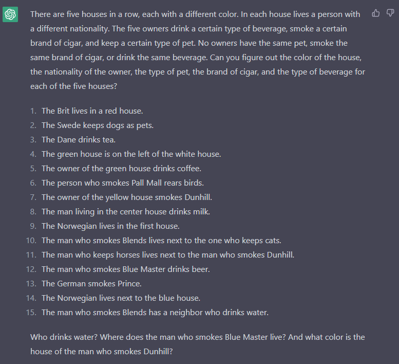
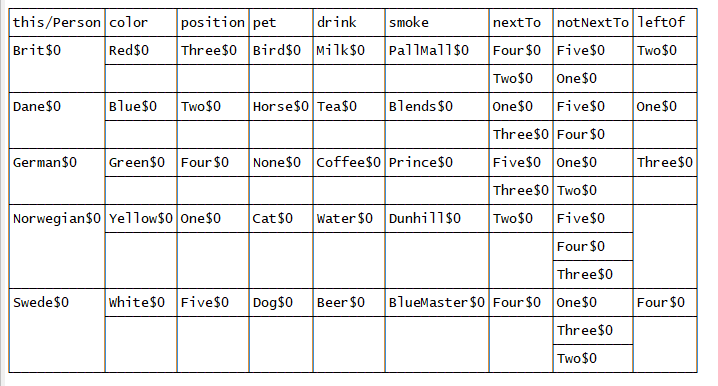

# AlloyTest
Learning about alloy by solving a riddle created in ChatGPT by FlugKiller. Initially when trying manually I thought it was impossible, but after figuring out the bugs and how alloy works, I got a solution. 

Alloy docs reference: 

https://www.monperrus.net/martin/alloy-quick-ref.pdf

https://alloy.readthedocs.io/

https://esb-dev.github.io/mat/alloy-cheatsheet.pdf

https://www.youtube.com/watch?v=FvNRlE4E9QQ

https://www.aosabook.org/en/500L/the-same-origin-policy.html

https://alloytools.org/book.html
## Puzzle

## Solution

